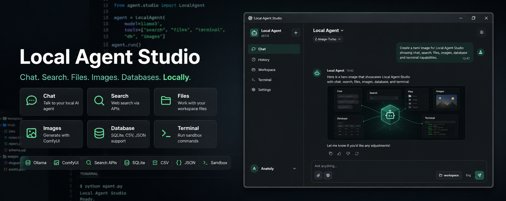
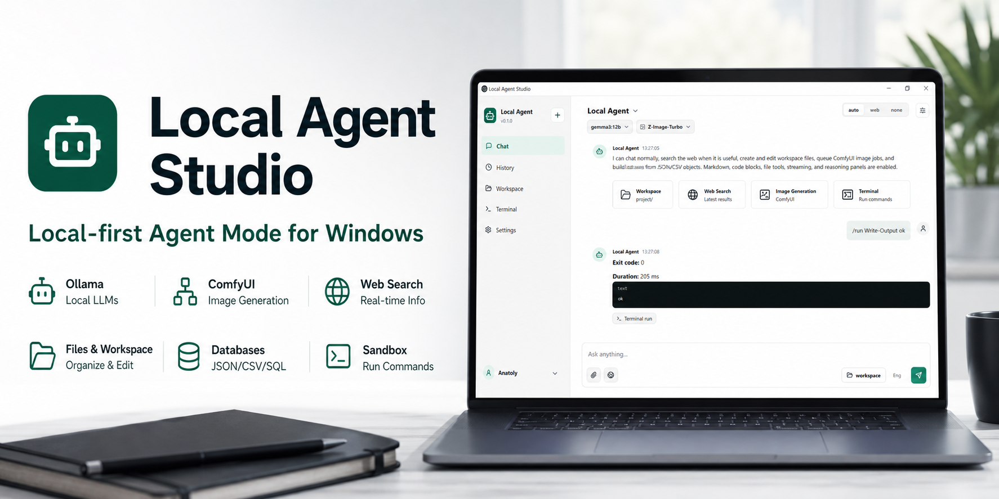
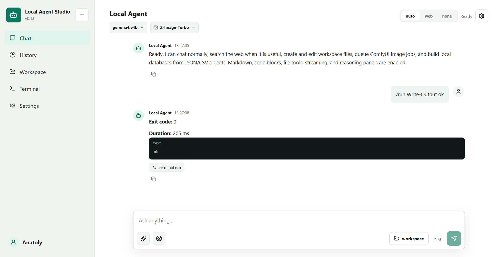

<<<<<<< HEAD


# Local Agent Studio

**Local-first Agent Mode for Windows.**  
A ChatGPT/Claude-style desktop app that connects your local and API-powered tools: **Ollama**, **ComfyUI**, web search providers, workspace files, local databases, and sandbox commands.


Local Agent Studio is built for people who want a normal chatbot interface, but with tools they control locally or through their own API keys.

## Highlights

- **Chatbot UI** inspired by ChatGPT, Claude, and Open WebUI.
- **Ollama chat** with streaming responses.
- **Reasoning panel** for models that return thinking traces.
- **Multimodal attachments** for images, audio, video, text, and files.
- **Native image input** for Ollama vision-capable models.
- **Web search** through SearXNG, SerpAPI, or Ollama Web Search.
- **Search summarization** instead of raw result dumps.
- **Up to 3 web searches** per user request.
- **ComfyUI image generation** with bundled workflows.
- **Image model picker** for Z-Image-Turbo, Flux.2 klein 9b, and Ideogram v4.
- **Ideogram v4 effort selection**: turbo, default, quality.
- **Workspace file tools**: create, read, edit, delete, and preview text files.
- **Local database creation** from JSON/CSV-like objects: JSON DB, CSV export, and SQLite.
- **Sandbox commands** through subprocess or Docker mode.
- **Themes**: system, light, dark.
- **Languages**: English, Russian, Ukrainian, German, Polish.

## Screenshots





## What It Can Do

Ask it like a normal assistant:

```text
What is the current price of Meta Quest 3S in Ukraine?
```

If web access is enabled, the agent can run search queries, collect context, and synthesize a readable answer.

Create files in the workspace:

```text
Create a test text file with "letter 123" inside.
```

Generate images through ComfyUI:

```text
Generate 3 product shots of a local AI desktop app, use Ideogram quality mode.
```

Create a database from objects:

```text
Create a database named products from objects:
[
  {"name": "Quest 3S", "price": 299},
  {"name": "Quest 3", "price": 499}
]
```

Run a sandbox command:

```text
/run Get-ChildItem
```

## Download

The Windows installer is generated at:

```text
release/Local Agent Studio-0.1.0-x64.exe
```

If you are publishing this project on GitHub, attach the installer to a GitHub Release.

## Quick Start From Source

Requirements:

- Windows 10 or newer
- Node.js 20+
- npm
- Ollama for local LLMs
- ComfyUI for image/video workflows
- Docker, optional, for SearXNG and sandbox isolation

Install dependencies:

```powershell
npm.cmd install
```

Run in development mode:

```powershell
npm.cmd run dev
```

Build the frontend:

```powershell
npm.cmd run build
```

Run the packaged-style Electron app:

```powershell
npm.cmd start
```

Build the Windows installer:

```powershell
npm.cmd run package:win
```

## Local Services

### Ollama

Start Ollama:

```powershell
ollama serve
```

Pull a model:

```powershell
ollama pull llama3.1:8b
```

You can keep the model setting as `auto`, or set a model manually in Settings. The app also includes quick presets for Gemma 4-style model names:

```text
gemma4:e2b
gemma4:e4b
```

### ComfyUI

Default endpoint:

```text
http://localhost:8188
```

Bundled workflow files:

```text
electron/workflows/image_z_image_turbo.json
electron/workflows/image_flux2_text_to_image_9b.json
electron/workflows/ideogram_v4.json
```

Supported image presets:

- `Z-Image-Turbo`
- `Flux.2 klein 9b`
- `Ideogram v4`

For Ideogram v4, the app exposes:

- `turbo`
- `default`
- `quality`

### SearXNG

The repo includes a Docker Compose file for local search:

```powershell
docker compose -f docker-compose.searxng.yml up -d
```

Default endpoint:

```text
http://localhost:8080
```

## Search Providers

Local Agent Studio supports:

- **SearXNG** for local/self-hosted search.
- **SerpAPI** through your own API key.
- **Ollama Web Search** through your own API key.

Environment variables:

```powershell
$env:SEARCH_PROVIDER="searxng"
$env:SERPAPI_API_KEY="..."
$env:OLLAMA_API_KEY="..."
$env:SEARXNG_BASE_URL="http://localhost:8080"
```

You can also configure providers inside the app Settings.

## Configuration

Settings are stored locally in the Electron user data folder.

Useful environment variables:

```powershell
$env:LOCAL_AGENT_WORKSPACE="C:\Users\You\LocalAgentStudio\workspace"
$env:LOCAL_AGENT_THEME="system"
$env:LOCAL_AGENT_LANGUAGE="en"
$env:OLLAMA_BASE_URL="http://localhost:11434"
$env:OLLAMA_MODEL="auto"
$env:OLLAMA_THINKING="auto"
$env:COMFYUI_BASE_URL="http://localhost:8188"
$env:SEARCH_PROVIDER="searxng"
```

## Workspace

The Workspace tab lets you:

- Browse workspace files.
- Create new files.
- Read text files.
- Edit and save text files.
- Delete files or folders.
- Open the workspace folder in Windows.

The agent can also perform workspace actions from chat, for example:

```text
Create notes/todo.md with a checklist for publishing the project.
```

## Databases

The agent can create simple local databases from structured objects.

Outputs:

- `databases/<name>.db.json`
- `databases/<name>.csv`
- `databases/<name>.sqlite`, when the runtime supports `node:sqlite`

Example:

```text
Create database named launch-list from objects:
[
  {"site": "Hacker News", "status": "planned"},
  {"site": "Product Hunt", "status": "later"}
]
```

## Chat Commands

```text
/search <query>
```

Force web search and answer synthesis.

```text
/run <command>
```

Run a command in the selected sandbox mode.

Natural language image generation also works:

```text
Generate a GitHub banner for this project using Flux.
```

Explicit image command examples:

```text
/image local AI desktop app hero banner --count 3
/image product screenshot in a laptop mockup --model ideogram --effort quality
```

## Project Structure

```text
.
├─ electron/
│  ├─ backend/
│  │  ├─ attachments.cjs
│  │  ├─ comfy.cjs
│  │  ├─ config.cjs
│  │  ├─ data.cjs
│  │  ├─ files.cjs
│  │  ├─ llm.cjs
│  │  ├─ providers.cjs
│  │  ├─ sandbox.cjs
│  │  └─ search.cjs
│  ├─ workflows/
│  ├─ main.cjs
│  └─ preload.cjs
├─ src/
│  ├─ components/
│  ├─ App.tsx
│  ├─ i18n.ts
│  └─ styles.css
├─ docs/
│  ├─ assets/
│  ├─ PROMO_PLAN.md
│  └─ rendered-screen.png
├─ docker-compose.searxng.yml
└─ package.json
```

## Development Checks

Build:

```powershell
npm.cmd run build
```

Capture an Electron screenshot:

```powershell
npx.cmd electron .\scripts\capture-electron.cjs
```

Interactive capture:

```powershell
$env:LOCAL_AGENT_CAPTURE_INTERACT="1"
npx.cmd electron .\scripts\capture-electron.cjs
Remove-Item Env:\LOCAL_AGENT_CAPTURE_INTERACT
```

The screenshot is saved to:

```text
docs/rendered-screen.png
```

## Roadmap

- Finished ComfyUI job watcher that pulls generated images back into chat.
- Search source cards with extracted price tables.
- Model capability registry for text, image, audio, video, reasoning, and context size.
- Conversation history saved as local projects.
- SQLite/CSV/JSON table viewer.
- Ask-before-write approval mode for risky actions.
- Git tools: status, diff, commit summary, changelog.
- Workspace RAG/indexing.
- Plugin system for custom tools.
- First-run setup wizard.
- Signed icon and branded installer.

## Security Notes

- `subprocess` mode runs commands on the host machine.
- Use Docker mode for untrusted commands.
- Workspace file operations are scoped to the configured workspace directory.
- API keys are stored locally in app settings or read from environment variables.
- Review tool output before relying on generated files, commands, or search results.

## Contributing

Issues and pull requests are welcome. Useful contributions:

- New ComfyUI workflows.
- Better model presets.
- Search provider integrations.
- UI polish.
- Windows installer improvements.
- Documentation and demo videos.

## License

Apache License 2.0. See [LICENSE](LICENSE).
=======
# Local-Agent-Studio
>>>>>>> origin/main
